##  Why Staking Validators?

Consider a scenario as described in the illustration below, with multiple UTXOs at a `Spending Validator`; if your entire protocol logic resides within it, the logic has to run for each UTXO, quickly reaching transaction limits and increasing CPU and memory usage.

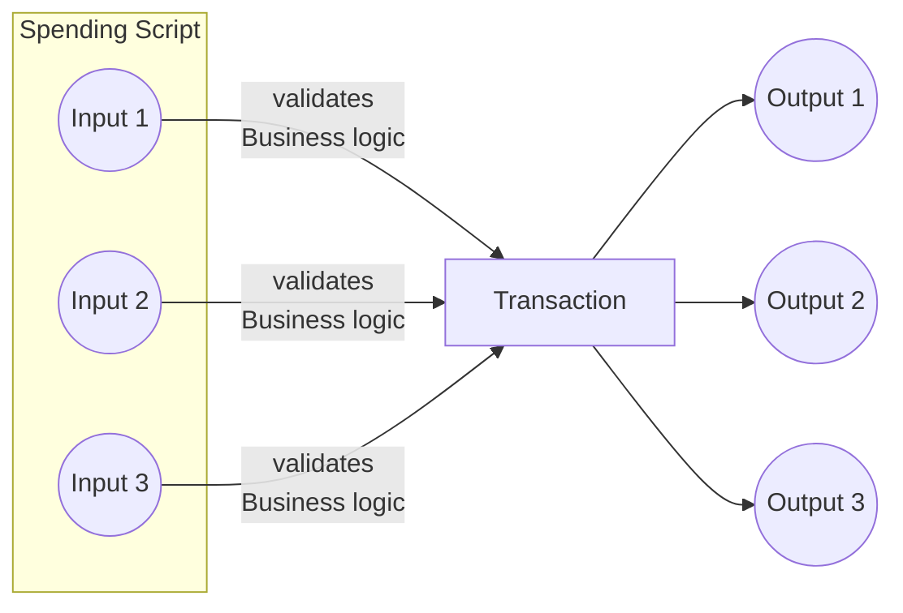

The solution involves the `Spending Validator` checking that the `Staking validator` is called in the same transaction, consolidating the logic to run once at the `Staking Validator`. This significantly reduces script size and simplifies business logic.

## What are the component of a Script Address?
Addresses are not only used in wallet, but also in smart contracts, often referred to as scripts.

For the purpose of this article we are going to create an Script Address by hashing the Spending Validator and the Staking Validator. 

#### Constructing the Script address
In the below code we can see that our address is composed of the Spending Validator and Staking Validator
```haskell
scriptAddress = 
  Address 
    (ScriptCredential $ ScriptHash "SpendingValidatorHash") 
    (Just $ StakingHash $ ScriptCredential $ ScriptHash "StakingValidatorHash")
```

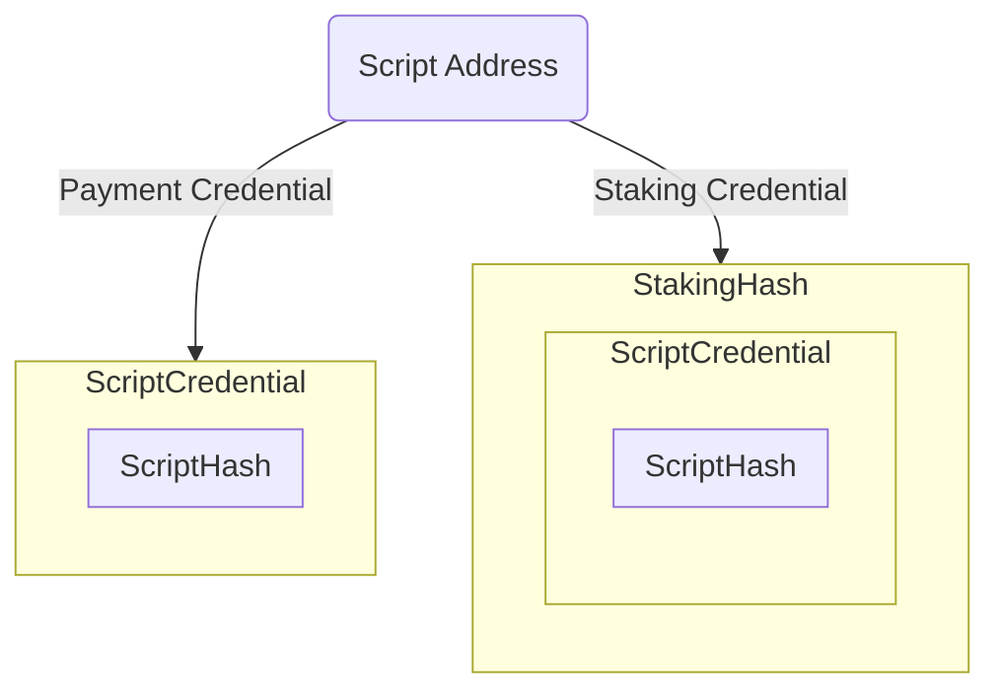
Once you have the script address and following your business logic, now you can lock assets along with datums into the Script Address, therefore associating the new EUTXO and the Script Address with both components `Payment Credential` and `Staking Credential`

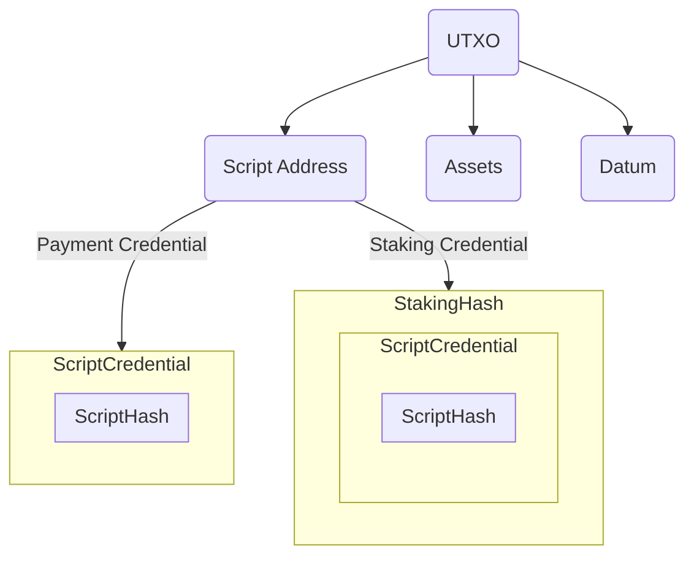
## Let's dive into the implementation

The strategy involves enforcing the spending validator to require invocation of staking validator, upon each attempted expenditure of the script input.
Following this, the staking validator assumes the responsibility of validating each spending script input to ensure strict adherence to the protocol specifications.

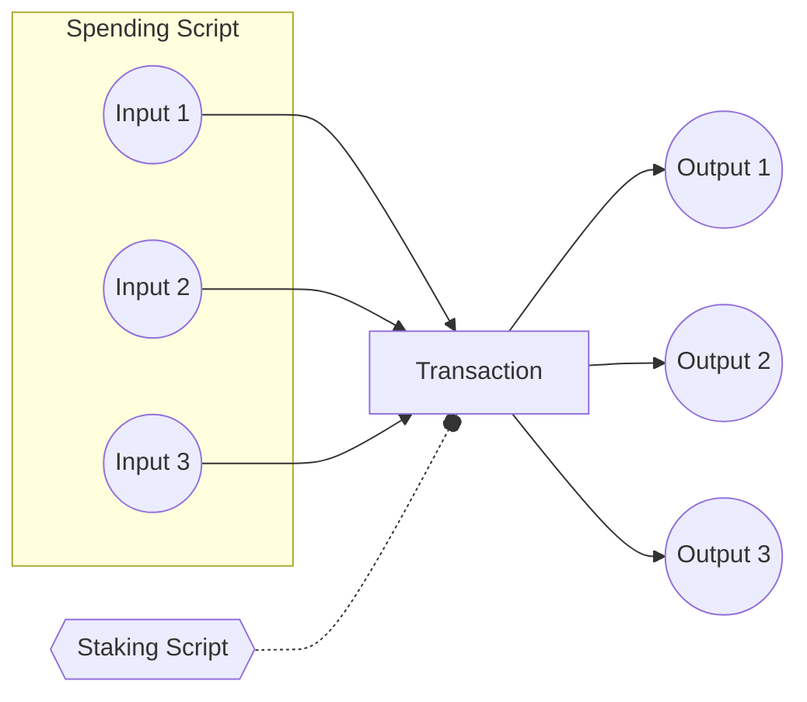


## Shinkai

Set up Protocol Parameter Datum and Formula Script.

### Protocol Parameter

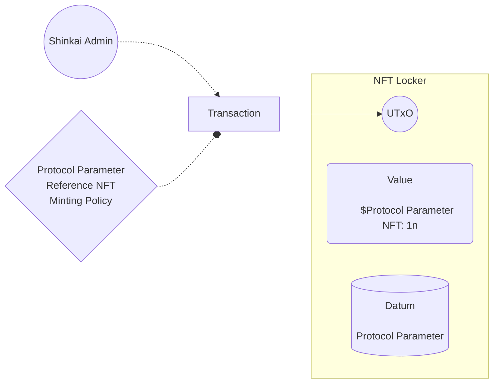

### Formula Script

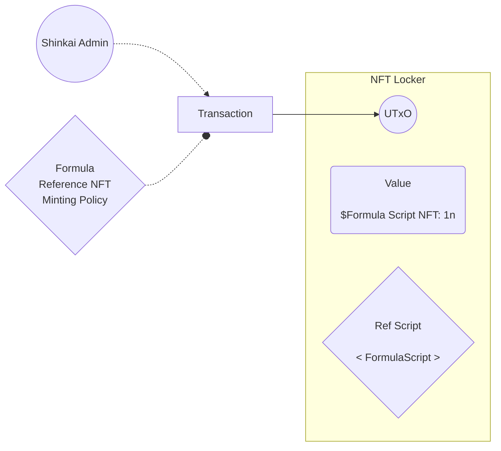

## Transactions

### Update Protocol Parameter

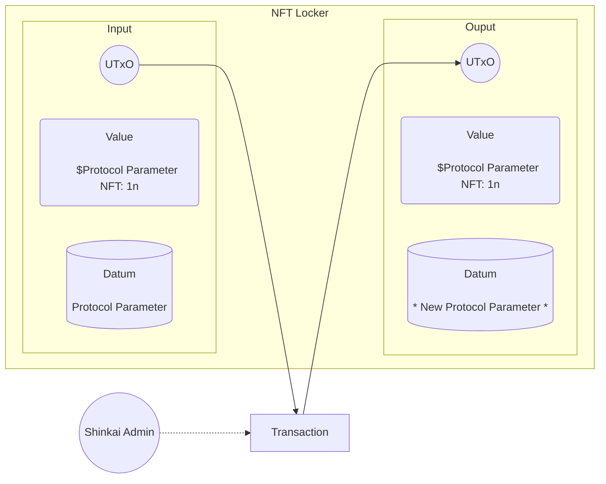

### Update Formula

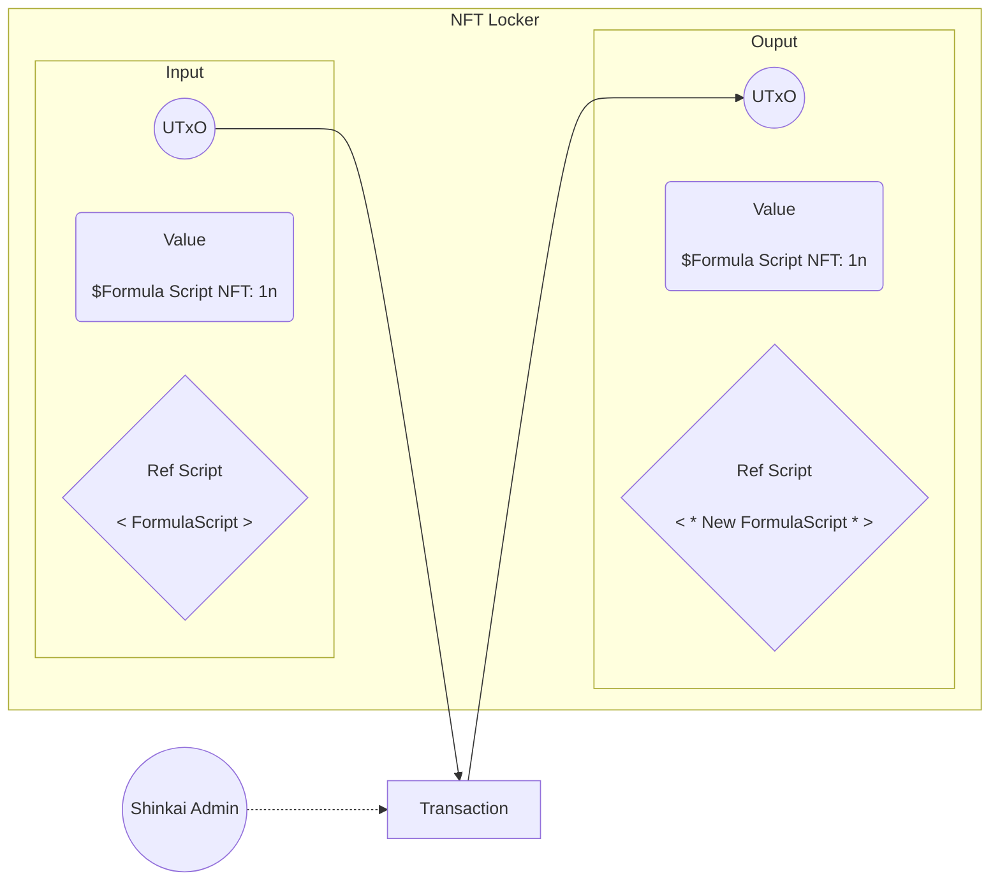

### Init Linked List

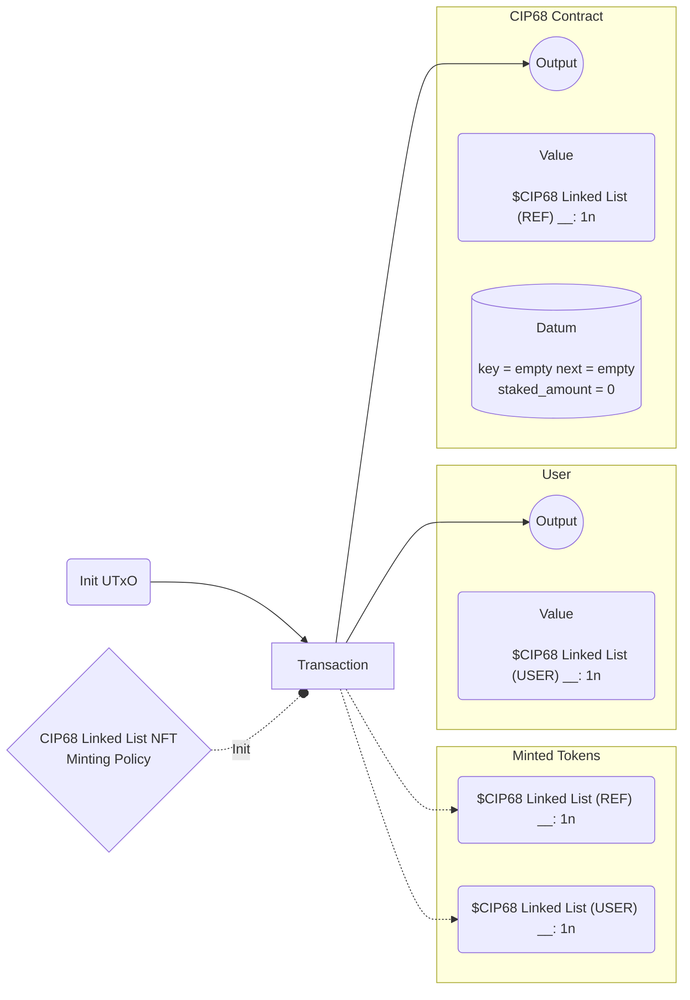

### Register New Handle

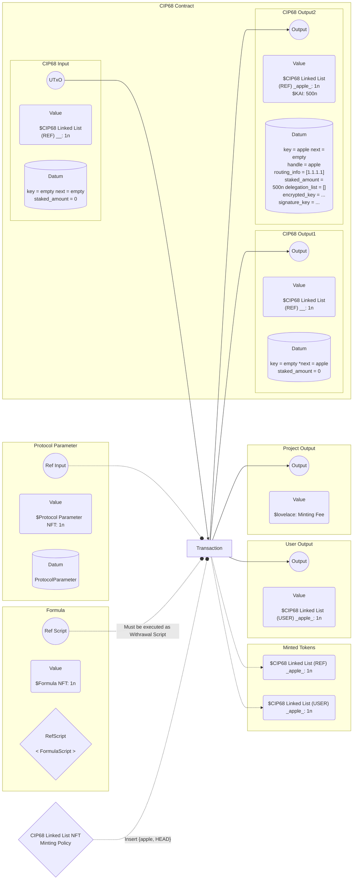

### Remove Handle

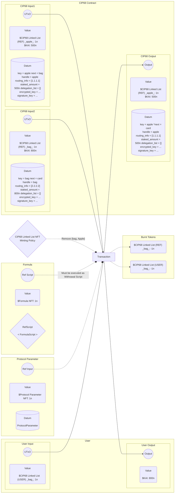

### Update Metadata

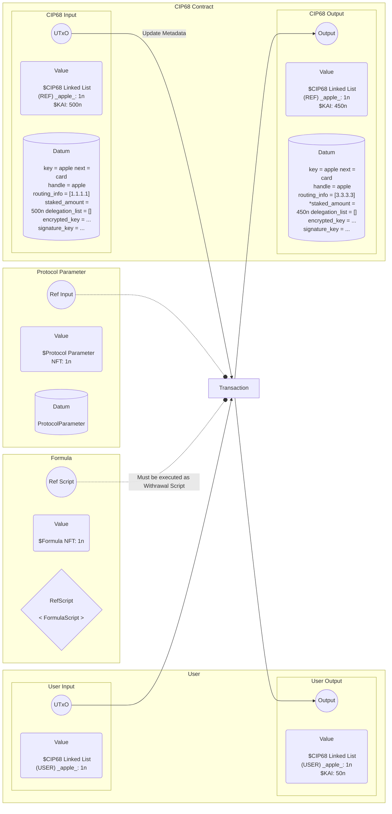

## IBC Audit
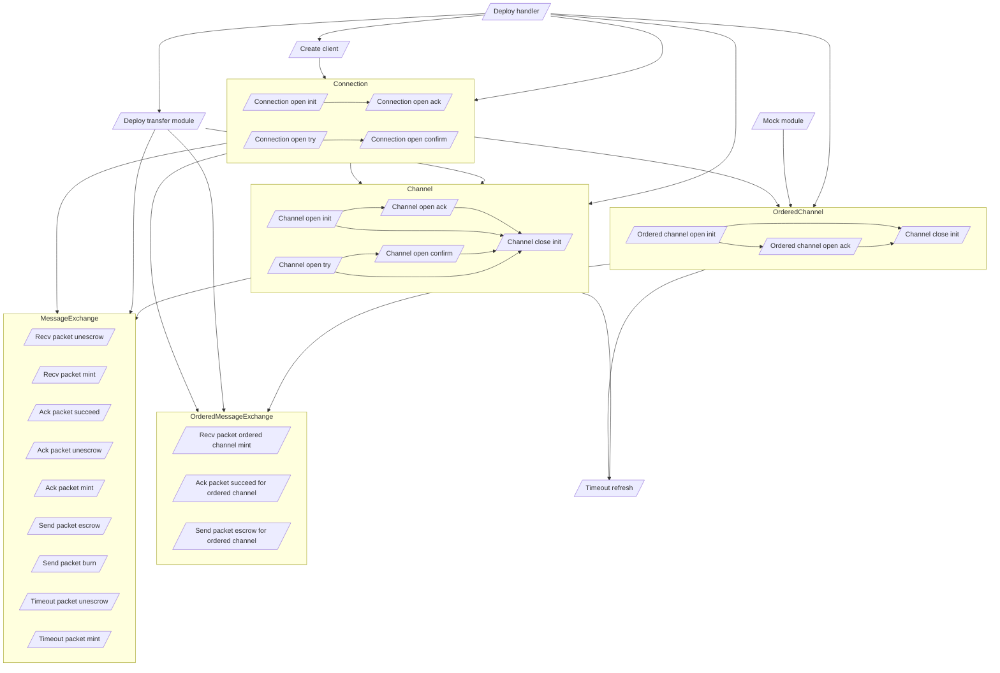