# Flowchart
- nodes (geometric shapes) and edges (arrows or lines)

## Default Node:

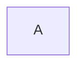

## Node with Text:

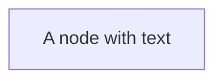

## A node with rounded edges

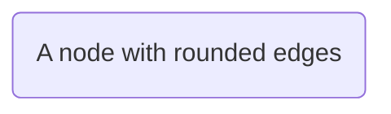

## Cylindrical shaped node 
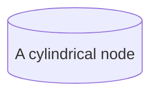

## Circular shaped node 

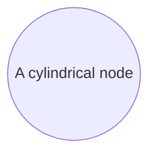


## Direction = LR | RL | TB | BT | TD

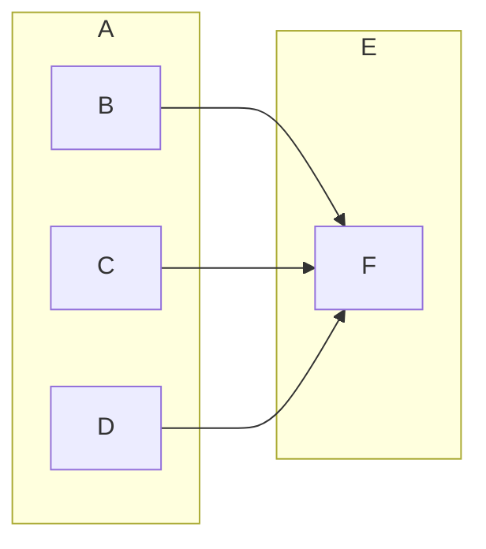

## Subgraph 

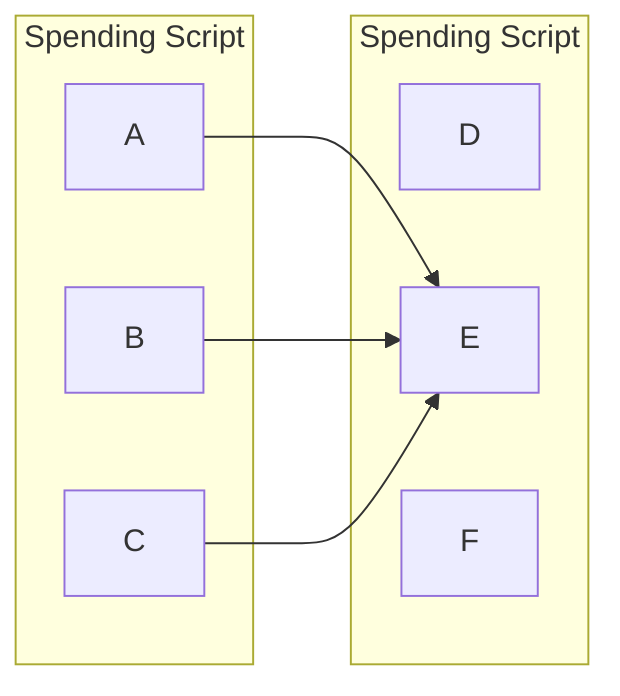

<!-- Multisig Update -->
###  Inputs

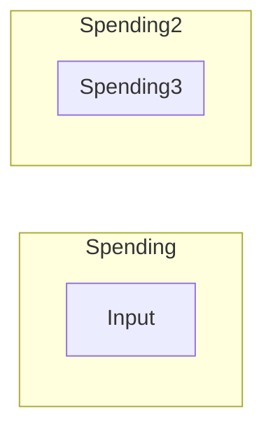

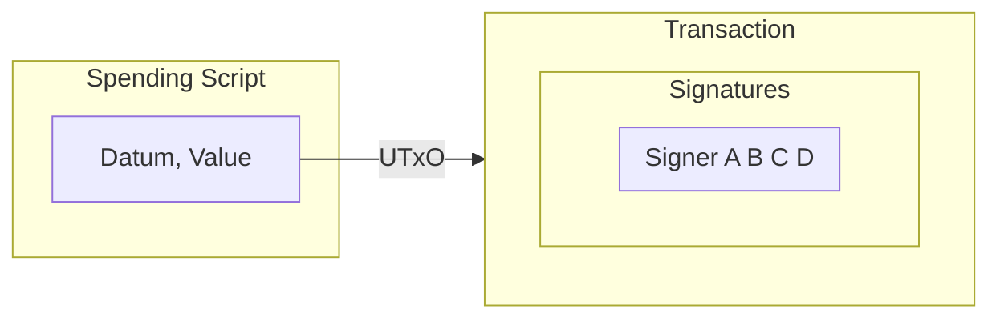

## Outputs

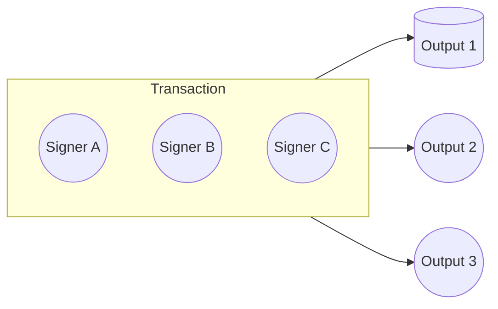

## Transaction Diagram

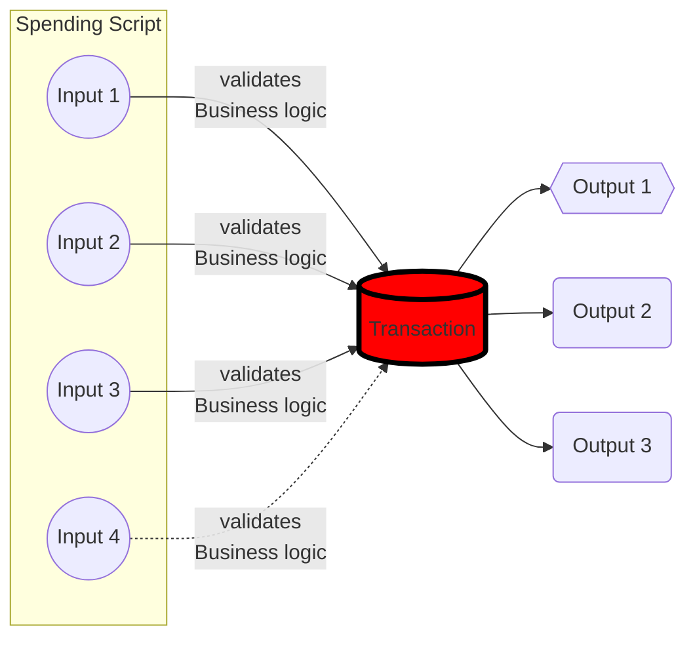


# Sequence Diagram

## Service-Account-Payment Workflow -->

 ```mermaid

sequenceDiagram
    participant Merchant
    participant ServiceValidator
    participant AccountValidator
    participant PaymentValidator
    
    Merchant->>ServiceValidator: CreateService
    ServiceValidator->>Merchant: ServiceNFT
    User->>AccountValidator: CreateAccount
    AccountValidator->>User: AccountNFT
    User->>PaymentValidator: InitiateSubscription
    PaymentValidator->>ServiceValidator: VerifyService
    PaymentValidator->>AccountValidator: VerifyAccount
    PaymentValidator->>User: PaymentNFT

```
<!-- PlantUML : https://plantuml.com/ -->

<!-- https://github.com/blushft/go-diagrams -->

<!-- ASCII Diagrams

- https://asciiflow.com/

- https://monodraw.helftone.com/ -->


